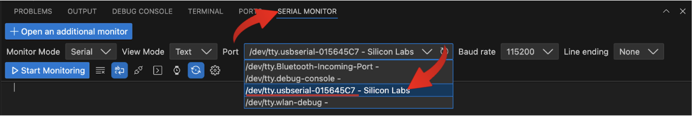
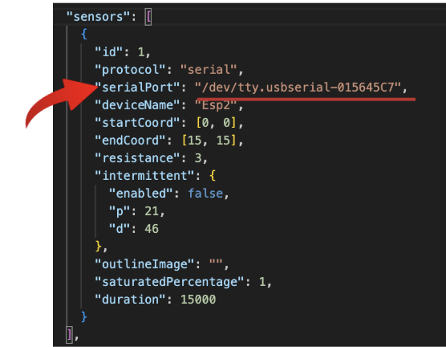
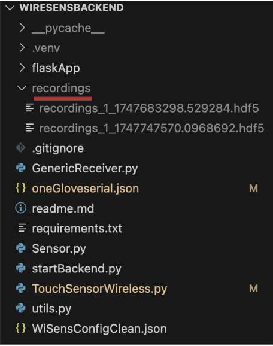

# WiReSens Python Backend

This guide walks you through setting up the Python Backend for WiReSens to record pressure data locally and reconfigure devices over USB. 

The backend source code is available here: [Source Code](./assets/WiReSensBackend-main.zip)

---

## Setup

1. **Install Python (version > 3.10)**  
   You can download Python from [https://www.python.org/downloads/](https://www.python.org/downloads/)

2. **Open WiReSensBackend folder and open New Terminal**  
   From root directory of WiReSensBackend *Cmd + Shift + P* and select "Create Environment"  
   Select Python 3.10 as interpreter

3. **Install required dependencies**  
   Run the following command in your terminal:

   ```
   pip install -r requirements.txt
   ```

---

## Hardware

1. **Plug in your microcontroller via USB.**

2. **Identify the serial port assigned to your device:**

   - **Linux:**

     ```
     dmesg | grep tty
     ```

     Should look something like: `/dev/ttyUSB0` or `/dev/ttyACM0`

   - **macOS:**

     ```
     ls /dev/tty.*
     ```

     Should look something like: `/dev/tty.usbserial-110` or `/dev/tty.usbmodem14101`

   - **Windows:**
     Open **Device Manager**, expand **Ports (COM & LPT)**, and find something like: `COM5`

3. **Select port in Serial Monitor**
   

4. **Update config file**

   Open `oneGloveserial.json`, locate the `"serialPort"` field under `"sensors"`, and set its value to your device’s serial port name.  
   Example:

   ```json
   "serialPort": "/dev/ttyUSB0"
   ```

   

---

## To Run the USB Recording Example

1. **Start the backend:**

   ```
   python startBackend.py
   ```

2. **Open the frontend in a browser:**  
   Go to: [https://wi-re-sens-web.vercel.app/](https://wi-re-sens-web.vercel.app/)

3. **Load configuration:**

   - Click **Load Config** and select `oneGloveserial.json`.

4. **Program Device:**

   - If it is your first time using this device, you may have to program it before recording. Click Device Panel > Edit Icon > Program Device. A "programmed!" message will appear if this is succesful.

5. **Start recording:**
   - Click **Record**.  
     Visualization and recording will start simultaneously.  
     Recordings are saved to the `recordings/` folder.  

   
