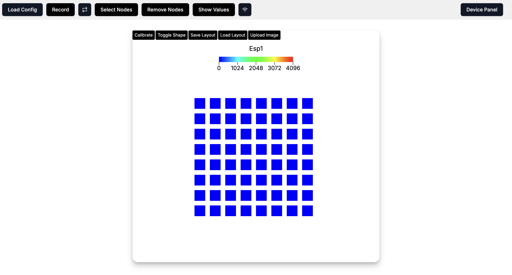

# Web GUI

The WiReSens Toolkit Web GUI serves as a control panel for configuring devices, wireless data transmission, and visualization. It provides plug-and-play infrastructure for working with the WiReSens Toolkit.

It can be used from the deployed site: [https://wi-re-sens-web.vercel.app/](https://wi-re-sens-web.vercel.app/)

Or can be setup locally for use in environments without internet access: [Source Code](./assets/WiReSensWeb-main.zip). The instructions for local setup are below. 

## Introduction

Make sure you have [Node](https://nodejs.org/en/download) and [npm](https://www.npmjs.com/package/npm/v/10.9.2) installed.

You can check by running node -v and npm -v from the terminal. 

## Getting Started

Open *WiReSensWeb* folder and open New Terminal

First, install the dependencies:

```bash
npm install
# or
yarn
# or
pnpm install
```

Then, run the development server:

```bash
npm run next-dev
```

Open [http://localhost:3000](http://localhost:3000) with your browser to see the result.



Deploys WiReSensWeb locally and listens for [WiReSensBackend](/backend) (Python) running on your machine.  
**Backend must be running for frontend to function properly.**

## Functions
1. **Load Config**  
    Will propt you to choose a file. You'll need to upload the oneGloveserial.json file. Make sure you've already started the Backend as instructed.  

2. **Record**  
    Click to start both the visual display and data recording simultaniously. All your recordings will be saved in the `recordings/` folder within the Backend directory.

3. **Toggle 3D/2D**  
    Use to switch between a high-resolution 3D visual display and a simpler 2D orientation.

4. **Load Layout**  
    Will prompt you to choose a file. To view the 3D visualization as a handprint shape, upload the heatmap3d_layout.json file.