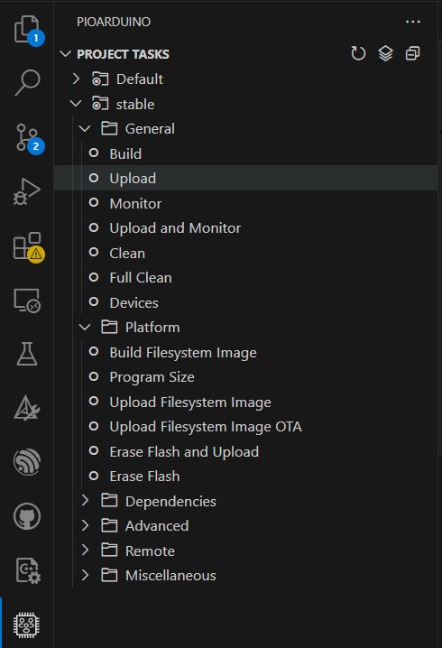

# Hardware

The WireSens Toolkit comes with two open-source zero potential readout circuits for interfacing with resistive matrix-based sensors.

The large circuit supports up to 32 row and column electrodes (for 1024 pressure sensing points) and can be ordered/assembled from [JLCPCB](https://jlcpcb.com/) for $90.26 USD.

- [Large Circuit Gerber Files](./assets/gerbers_32.zip)
- [Large Circuit BOM](./assets/bom_32.csv)
- [Large Circuit Componet Placement](./assets/positions_32.csv)
- [Large Circuit KiCad Source](./assets/source_32.zip)

The small circuit supports 16 row and column electrodes (for 256 pressure sensing points), and can be ordered/assembled from [JLCPCB](https://jlcpcb.com/) for $140.92 USD

- [Small Circuit Gerber Files](./assets/gebers_16.zip)
- [Small Circuit BOM](./assets/bom_16.csv)
- [Small Circuit Componet Placement](./assets/positions_16.csv)
- [Small Circuit KiCad Source](./assets/source_16.zip)

# Firmware

When your hardware comes, you will need to flash the initial firmware by following the instructions below. 

The firmware is available here: [Firmware](./assets/WiSensToolkit.zip) and can be uploaded using vscode. 

This library is set up to be developed with pioarduino (built on top of platformio).

### Prerequisties

Install pioarduino via vscode: https://github.com/pioarduino/platform-espressif32 (follow steps under IDE preparation)

### Get started

Open this folder. The pioarduino extension should recognize it and configure the environment/install necessary packages.

Connect the esp32 and open the vscode command window (Ctrl + shift + P). Search "Set project port" and select the serial port of the connected device accordingly.

The upload button will flash the "nocalibrate.cpp" source to the device (this is the most up-to-date firmware)

### Known Issues

I don't think pioarduino likes being installed simultatenously with a pre-exisitng installation of platformio. If you already have platformio install on your machine, please uninstall it from vscode, delete the .platformio folder (usually under users/`<your name>`), and install pioarduino as described above.

