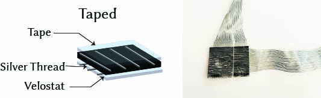
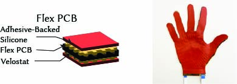
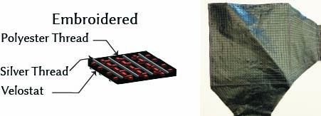
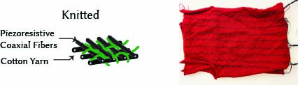

Resistive Matrix-based tactile sensors can be made using a wide range of fabrication techniques. Detailed instructions for making sensors using the techniques of direct taping, flexible printed circuit boards, digital embroidery, and machine-knitting are below. Each technique has been tested and is compatible with the WiReSens Toolkit. We provide a recommended WiReSens Toolkit-compatible configuration file for each sensor based on our experiments. 

# Direct Taping

## Material List

* [Pressure-sensitive conductive sheet (Velostat/Linqstat)](https://www.adafruit.com/product/1361)
* [Conductive thread](https://www.adafruit.com/product/640)
* [Conductive fabric](https://www.amazon.com/ZTTXL-43-Big-Yards-Conductive/dp/B0CL94L9L3/ref=sr_1_3?crid=139TEDO31KRTH&dib=eyJ2IjoiMSJ9.8CUEC2eUsRSotBR7x0M9zuHCvaa41kNeHp-i8tPde-9LwQF3h0ZzX8tN9iPrw_c9PdBIztBRvqlKobZcffHlSJfCnr2mpeVhERe2F05pOF5wBlA1bCi2L11R9yCrZw8BAtA2Dwiz_fGfKyuNlr1uElfImP3bACXG8uqEwnGf3EIRKZssuVzelPqwOlmSUuuWO7NsBpdVq2Xu89ZL6bOtZWlN_VE05b_4R8pt8fiSJFY.9pq3ZbjTgZhnxEuRhZ5JPf3WJu5cGeeO44Nv7YJC9bk&dib_tag=se&keywords=conductive+fabric&qid=1733161383&sprefix=conductive+fabri%2Caps%2C199&sr=8-3)
* [Conductive tape](https://www.amazon.com/Zehhe-Copper-Foil-Double-Sided-Conductive/dp/B01MR5DSCM/ref=sr_1_3?dib=eyJ2IjoiMSJ9.cqRGJNe2umEWoyvVg4GeB-hNEYmZG5s-bPvczGNWHJV3lEvPeEtq2fLUqwZNs-vlW_YgyKWf_hdWypDCMdeCa0Warbsq5Wq5dUbPkvOMmNMb0DqB5Hr5quOlWsypiDAgIMUcU4Hw2oPucoyJLSpeNxNztdSRwVC40U3SqyC-wB19JJBuDmuvAWX1_BzFhOFTB3NTmU7OTMFc6UWbrDNhI8nO4tJupPoGuLQuF0aX7Vg.M-J_iGFPyZ9avjydWS0ojiZoGXIIzHcpNXcMVRpRi_A&dib_tag=se&hvadid=598803698565&hvdev=c&hvlocphy=1018145&hvnetw=g&hvqmt=e&hvrand=13739131640568959892&hvtargid=kwd-1794410423&hydadcr=2077_13503863&keywords=conductive+foil+tape&qid=1713291398&sr=8-3)
* [34-pin ribbon cable](https://www.amazon.com/Connectors-Pro-Conductors-1-27mm-Ribbon/dp/B08GHV6ZSX/ref=sr_1_2?dib=eyJ2IjoiMSJ9.lwjeNsWRj88HECW_QN2vSbh9OAi_jTGMhWdgwSbzX6khmvoxFWwmuzsHk8AD79M_lkbZ_W8ECeBV56ZcHHWv1vC_02hZHNbigH5mC5VQar-qB2GMqrG1C__FGGKvHpI_VedI6WYBw9xRXt4LrTPzPmvzb5uKayL0lJ53dhi_rbyaoXwJLzC65_oXRb9LKw9b1VEcfY78BOjAm6KYNuIz4_oSPhwUC8oiWauZkVtXf7zHLdbjFzwuh2ZB8iicSFQpQLkEUAcc3q9ygxpmaYhKY60voukatFVVh0EpW8-S-Y0.ta3y5hFPKaxYKe6YTwreAtCKX_VJtznYbpVYIePKN-Q&dib_tag=se&hvadid=570571435160&hvdev=c&hvlocphy=1018145&hvnetw=g&hvqmt=e&hvrand=14076163878603723245&hvtargid=kwd-315073834033&hydadcr=18009_13462286&keywords=34+pin+ribbon+cable&qid=1713291469&s=electronics&sr=1-2)
* [34-pin connector](https://www.amazon.com/CablesOnline-10-Pack-34-Pin-Connectors-FC-034-10/dp/B07W4GBQZ4/ref=sr_1_5?crid=2HMQ3HVBQH2MI&dib=eyJ2IjoiMSJ9.IBqMmEq7eR1f0PRUHMmE3YgWC6FiqKyBPUueqFBJ9hfLxz_tuaNyCgpK9gTYXTD3UPELhDRHMaFA7KbzOdfitk9Q7B0LnWgVn2n7mkRlS3-TXfM3E17yuBuxirkX7t2tM6VSDdl8WHwss-E6mehQBzl6FMgoAyHgifuSSU6yhHclrpJ2IMGPIjJiUx3KOjLTyFERjJ1Aily-XuK9woeGg6yEKEXL7Ocyk4-5dTjBnCM98-PR146Osv_vqtjEXWiqgYI4Kh6GtSdeLHGIoUzQ7LYVBWO6vC-Z1kB-x1X3WfY.gHmhbyb-K_tScXs0W_t1wiPJBrR2ydqtoQZuFu3biBQ&dib_tag=se&keywords=34+pin+ribbon+cable+female+connector&qid=1713291563&s=electronics&sprefix=34+pin+ribbon+cable+female+connector%2Celectronics%2C101&sr=1-5)
* [Thin adhesive (3M 467MP or similar)](https://www.amazon.com/467MP-Clear-Adhesive-Transfer-length/dp/B007Y7CV86/ref=sr_1_6?crid=4LGOBM16QLKK&dib=eyJ2IjoiMSJ9.ZenxXn1UJFV5_JdMLJRBWw_yShM070XzQHB77v47ksz01RWkLaujzYqyiF_40xB5qc5dMlVVx5XIlr2CYyEkSgnYGXNxI33n8_yoGu_rdMXHFgpejrbId8Xf8oHnrpniHUBcuhH_IO-U5V5m2fEt-Sv9l4WVrWeXSf4TufbSI7mUfOle8uEBrULnJ-h7of_7ehmMwCabrS53F5gaYUaMc0v_cZomcChCrYzyg6RZ0h0.PKGq_w4_YVl2kmHXqM6aITshPr3hek69pXC53nI_qxk&dib_tag=se&keywords=3m+m468+tape&qid=1713292002&sprefix=3m+m468+tape%2Caps%2C65&sr=8-6)
* [Thin plastic wrap (e.g., Saran Wrap)](https://www.amazon.com/Saran-Premium-Plastic-Wrap-100/dp/B00J5IMDMG/ref=sr_1_6?crid=CM08OVJQ87GF&dib=eyJ2IjoiMSJ9.d1GzVgGbPPXOlpV_DvEIugvJ2rkQ4gbryTgo3Npj8vWzxu-EXxPF1B4WuYxUeqeiE9oTjshFm2HtWm1E3Kj-ZAtnYaIXncjCr8XROrxJnD0orkNLDKrejoLzO0-dlX4QvhvvAPQ1HQiqXTcPEiVlt9owCX8yfUrGlxy2PSyj4ykpE17vVkn7NF5KGFMuhHFXyjePU0WW7RKMlBprcNbjp4JbRx73Bv5ctgAPgzFkKx_dqwoda6KcCSfSYkZ0NHuAhwUlHDt06Qp3WQ0DBwdZuQk9J22WRW5bhjFqsfm1f0s.lxIjaA7Iu4adwtFoVT_bST1cyEZlaVxGHmTNz6Tdzxo&dib_tag=se&keywords=saran+wrap&qid=1713292058&sprefix=saran+wrap%2Caps%2C108&sr=8-6)

## Instructions
1. Refer to material list and prepare materials. 
2. Cut pressure-sensitive sheet into desired shape.
3. Cut 2 pieces of thin adhesive into desired shape.
4. Align horizontal electrodes on one of the thin adhesive.
5. Attach the adhesive with aligned electrodes on one side of the pressure-sensitive film.
6. Align horizontal electrodes on the other piece of thin adhesive.
7. Attach the adhesive with aligned electrodes on the other side of the pressure-sensitive film.
8. Carefully remove the cover of adhesive, and attach the thin plastic sheet on top of it for insulation.
9. Repeat for the other side. 
10. Make electrical connection between the aligend vertical/horizontal electrodes with 2 sets of ribbon cables using either conductive/electrical tape or solder. 
11. Connect the ribbon cable with the readout circuit using the connector. 

## Configuration File

[tapedSensorConfig.json](assets/flexSensorConfig.json)

# Flexible Printed Circuit Board

---

## Material List

* [Adhesive-Backed Silicone Rubber (McMaster 9010K51)](https://www.mcmaster.com/catalog/131/4075/9010K51)
* [Pressure-sensitive Conductive Sheet (Velostat/Linqstat)](https://www.adafruit.com/product/1361)
* [PLA Filament](https://www.matterhackers.com/store/l/pro-series-pla/sk/MY6C8H7E)
* [0.5 mm Pitch Flex Cable Connectors (16-pin)](https://www.amazon.com/dp/B07RY9QZ4Q)

---

## Assets

* [Front PCB Gerbers](assets/toppcbgerbers.zip)
* [Front PCB Component Placement (.pos)](assets/toppcbplacement.pos)
* [Back PCB Gerbers](assets/botpcbgerbers.zip)
* [Back PCB Component Placement (.pos)](assets/botpcbplacement.pos)
* [Top PCB Manufacturing Detail (PDF)](assets/toppcbdetails.pdf)
* [Bottom PCB Manufacturing Detail (PDF)](assets/botpcbdetails.pdf)
* [3D-Printed Alignment Guide (.STL)](assets/gloveSmallNestSized.stl)
* [Front/Back PCB BOM (.xlsx)](assets/pcbbom.xlsx)
* [Laser Cutting Outline (.svg)](assets/smallGloveCut.svg)
* [Laser Cutting Settings (.txt)](assets/lasercutting.txt)

---

## Instructions

1. **Order the flex PCB electrode arrays**
   Use the [Pcbway Instant Quote Tool](https://www.pcbway.com/flexible.aspx) to manufacture the top and bottom flex PCBs.

   * Submit **two separate orders**: one for the top array, one for the bottom array.
   * Carefully follow the fabrication specifications provided in the respective manufacturing detail PDFs.
   * Upload:

     * The appropriate Gerber files.
     * Component placement files (`.pos`).
     * The shared BOM file.
   * In the order comments, **copy-paste the notes** from the manufacturing detail PDFs exactly.

2. **Laser cut the Velostat and silicone rubber layers**
   Use a CO₂ laser cutter or outsource the job to a service such as:

   * [SendCutSend (for rubbers/plastics)](https://www.sendcutsend.com)
   * [Ponoko (small-scale fabrication)](https://www.ponoko.com)

   Instructions:

   * Use the provided `smallGloveCut.svg` outline file.
   * Cut **two** silicone rubber layers:

     * One in the **default orientation**.
     * One **mirrored horizontally**.
   * Cut **one** Velostat sheet.
   * Reference `lasercutting.txt` for ideal power/speed/frequency settings.

3. **3D print the alignment guide**
   Use the provided `.STL` file to print the mold used for layer alignment.

   * Print using PLA or other rigid filament.
   * Recommended infill: 20–40%, no supports needed.
   * If you prefer to outsource, try:

     * [Treatstock](https://www.treatstock.com)
     * [Craftcloud](https://craftcloud3d.com)

4. **Assemble the PCB layers**

   * Place the **bottom PCB** into the alignment mold.
   * Remove the **adhesive backing** from the PCB (if applicable).
   * Place the **laser-cut Velostat** on top, aligning carefully.
   * Gently remove the stack from the mold, **flip it upside down**.
   * Insert the **top PCB** into the mold.
   * Carefully **sandwich the bottom PCB and Velostat** onto the top PCB.
   * Remove the assembled three-layer structure from the mold.

5. **Add the silicone layers**

   * Place the **first silicone sheet** in the mold, **adhesive side up**.
   * Remove the backing tape.
   * Insert the **three-layer PCB structure** on top of the silicone.
   * Remove the partial stack and repeat with the **mirrored silicone sheet** on the opposite side.
   * You should now have a **five-layer sandwich**: silicone–PCB–Velostat–PCB–silicone.

6. **Connect the flex cables**

   * Gently **lift the 0.5 mm FFC connector latches**.
   * Insert the **flex cables** that connect the sensor to your readout electronics.
   * Close the latches to secure the connection.

---

**Note:**
If you don’t have access to a laser cutter or 3D printer, you can **outsource** fabrication to online services:

* **Laser cutting**: [Ponoko](https://www.ponoko.com), [SendCutSend](https://www.sendcutsend.com)
* **3D printing**: [Craftcloud](https://craftcloud3d.com), [Treatstock](https://www.treatstock.com)

---

## Configuration File

* [flexSensorConfig.json](assets/flexSensorConfig.json)

# Digital Embroidery

## Material List

* [Pressure-sensitive conductive sheet (Velostat/Linqstat)](https://www.adafruit.com/product/1361)

* [Conductive thread](https://www.madeirausa.com/hc-40-highly-conductive-embroidery-thread.html)

* [Conventional embroidery thread](https://www.amazon.com/ilauke-Bobbins-Threads-Polyester-Prewound/dp/B07QCSTRNF/ref=sr_1_1_sspa?crid=181O0Y0JPHUZ6&dib=eyJ2IjoiMSJ9._W5PesZubIqhYEiqHSVLhJQ1J4kohlDhYyW28R38xnesqW3qkR6FI6RLOPGlIqkOTZimM4xMNydm5Dj3iMoNeQOhJCTKvKlEmXahTo0tD4kKsl1JgoHKhSscofUeSjD_U_a40Fmn9ew85ywhrwjb-_4mvPfDXz0RWb7R8gbfVMzUzdkVD2X-mWeS6NFJhhj_oYAeFrl4aHIqU8MltPfpdqAiwuGgoKytkBxBZbFQRO4nAyfVbhfPC2iGTUKUC0YKP2d4AxdqMm9uhGLpa449Jb44kRoeaXkYn2apvrdlp5Y.hW25ZiN1Z_ZCLAluggkA-VuiE_ZtVbiesRC2Ami_tkQ&dib_tag=se&keywords=conventional+embroidery+thread+top+and+bobbin+set+mader&qid=1733162223&s=arts-crafts&sprefix=conventional+embroidery+thread+top+and+bobbin+set+mader%2Carts-crafts%2C124&sr=1-1-spons&sp_csd=d2lkZ2V0TmFtZT1zcF9hdGY&psc=1)

* [Embroidery backing](https://www.amazon.com/Non-Woven-fusible-Interfacing-Lightweight-Single-Side/dp/B088ZH2SD2/ref=asc_df_B088ZH2SD2?mcid=d2f62532d7b630d0a2a48585b886e7e4&tag=hyprod-20&linkCode=df0&hvadid=693594197274&hvpos=&hvnetw=g&hvrand=4556372633610379135&hvpone=&hvptwo=&hvqmt=&hvdev=c&hvdvcmdl=&hvlocint=&hvlocphy=9198466&hvtargid=pla-1873665551983&ps)

## Assets

* [Top Electrode Embroidery File (.pes)]()
* [Bottom Electrode Embroidery File (.pes)]()
* [34-pin ribbon cable](https://www.amazon.com/Connectors-Pro-Conductors-1-27mm-Ribbon/dp/B08GHV6ZSX/ref=sr_1_2?dib=eyJ2IjoiMSJ9.lwjeNsWRj88HECW_QN2vSbh9OAi_jTGMhWdgwSbzX6khmvoxFWwmuzsHk8AD79M_lkbZ_W8ECeBV56ZcHHWv1vC_02hZHNbigH5mC5VQar-qB2GMqrG1C__FGGKvHpI_VedI6WYBw9xRXt4LrTPzPmvzb5uKayL0lJ53dhi_rbyaoXwJLzC65_oXRb9LKw9b1VEcfY78BOjAm6KYNuIz4_oSPhwUC8oiWauZkVtXf7zHLdbjFzwuh2ZB8iicSFQpQLkEUAcc3q9ygxpmaYhKY60voukatFVVh0EpW8-S-Y0.ta3y5hFPKaxYKe6YTwreAtCKX_VJtznYbpVYIePKN-Q&dib_tag=se&hvadid=570571435160&hvdev=c&hvlocphy=1018145&hvnetw=g&hvqmt=e&hvrand=14076163878603723245&hvtargid=kwd-315073834033&hydadcr=18009_13462286&keywords=34+pin+ribbon+cable&qid=1713291469&s=electronics&sr=1-2)
* [34-pin connector](https://www.amazon.com/CablesOnline-10-Pack-34-Pin-Connectors-FC-034-10/dp/B07W4GBQZ4/ref=sr_1_5?crid=2HMQ3HVBQH2MI&dib=eyJ2IjoiMSJ9.IBqMmEq7eR1f0PRUHMmE3YgWC6FiqKyBPUueqFBJ9hfLxz_tuaNyCgpK9gTYXTD3UPELhDRHMaFA7KbzOdfitk9Q7B0LnWgVn2n7mkRlS3-TXfM3E17yuBuxirkX7t2tM6VSDdl8WHwss-E6mehQBzl6FMgoAyHgifuSSU6yhHclrpJ2IMGPIjJiUx3KOjLTyFERjJ1Aily-XuK9woeGg6yEKEXL7Ocyk4-5dTjBnCM98-PR146Osv_vqtjEXWiqgYI4Kh6GtSdeLHGIoUzQ7LYVBWO6vC-Z1kB-x1X3WfY.gHmhbyb-K_tScXs0W_t1wiPJBrR2ydqtoQZuFu3biBQ&dib_tag=se&keywords=34+pin+ribbon+cable+female+connector&qid=1713291563&s=electronics&sprefix=34+pin+ribbon+cable+female+connector%2Celectronics%2C101&sr=1-5)

## Instructions

1. Refer to material list and prepare materials. 
2. Use the above digital embroidery design file or [generate your own](https://yyueluo.com/tactile-skin-tool/resource/pyembroidery.zip)
3. Cut pressure-sensitive sheet into desired shape.
4. Mount pressure-sensitive sheet onto the digital embroidery frame.
5. Load conductive thread as top thread and polyester thread as bobbin.
6. Run machine with the first embroidery pass for vertical electrodes. 
7. Load conductive thread as bobbin and polyester thread as top thread. 
8. Run machine with the second embroidery pass for horizontal electrodes.
9. Add optional insulating layer using fabric or plastic film with adhesive. 
10. Make electrical connection between the vertical/horizontal electrodes with 2 sets of ribbon cables using either conductive/electrical tape or solder. 

## Configuration File

[embroideredSensorConfig.json](assets/embroideredSensorConfig.json)

# Machine Knitting

## Material List
 * [Graphite nanoparticles](https://www.us-nano.com/us1058)
 * [Copper Nanoparticles](https://www.us-nano.com/us1088)
 * [PDMS](https://www.dow.com/en-us/pdp.sylgard-184-silicone-elastomer-kit.01064291z.html#overview)
 * [OS2](https://www.dow.com/en-us/pdp.dowsil-os-2-fluid.03169073z.html#overview)
 * [Stainless Steel thread](https://www.sparkfun.com/conductive-thread-60g-stainless-steel.html)
 * [Acrylic Knitting Yarn](https://knitknackshop.com/shop/tamm-yarns/tamm-bebe-tamm-solid-colors/bebe-tamm-solid-colors-t3723-pumpkin/)
* [34-pin ribbon cable](https://www.amazon.com/Connectors-Pro-Conductors-1-27mm-Ribbon/dp/B08GHV6ZSX/ref=sr_1_2?dib=eyJ2IjoiMSJ9.lwjeNsWRj88HECW_QN2vSbh9OAi_jTGMhWdgwSbzX6khmvoxFWwmuzsHk8AD79M_lkbZ_W8ECeBV56ZcHHWv1vC_02hZHNbigH5mC5VQar-qB2GMqrG1C__FGGKvHpI_VedI6WYBw9xRXt4LrTPzPmvzb5uKayL0lJ53dhi_rbyaoXwJLzC65_oXRb9LKw9b1VEcfY78BOjAm6KYNuIz4_oSPhwUC8oiWauZkVtXf7zHLdbjFzwuh2ZB8iicSFQpQLkEUAcc3q9ygxpmaYhKY60voukatFVVh0EpW8-S-Y0.ta3y5hFPKaxYKe6YTwreAtCKX_VJtznYbpVYIePKN-Q&dib_tag=se&hvadid=570571435160&hvdev=c&hvlocphy=1018145&hvnetw=g&hvqmt=e&hvrand=14076163878603723245&hvtargid=kwd-315073834033&hydadcr=18009_13462286&keywords=34+pin+ribbon+cable&qid=1713291469&s=electronics&sr=1-2)
* [34-pin connector](https://www.amazon.com/CablesOnline-10-Pack-34-Pin-Connectors-FC-034-10/dp/B07W4GBQZ4/ref=sr_1_5?crid=2HMQ3HVBQH2MI&dib=eyJ2IjoiMSJ9.IBqMmEq7eR1f0PRUHMmE3YgWC6FiqKyBPUueqFBJ9hfLxz_tuaNyCgpK9gTYXTD3UPELhDRHMaFA7KbzOdfitk9Q7B0LnWgVn2n7mkRlS3-TXfM3E17yuBuxirkX7t2tM6VSDdl8WHwss-E6mehQBzl6FMgoAyHgifuSSU6yhHclrpJ2IMGPIjJiUx3KOjLTyFERjJ1Aily-XuK9woeGg6yEKEXL7Ocyk4-5dTjBnCM98-PR146Osv_vqtjEXWiqgYI4Kh6GtSdeLHGIoUzQ7LYVBWO6vC-Z1kB-x1X3WfY.gHmhbyb-K_tScXs0W_t1wiPJBrR2ydqtoQZuFu3biBQ&dib_tag=se&keywords=34+pin+ribbon+cable+female+connector&qid=1713291563&s=electronics&sprefix=34+pin+ribbon+cable+female+connector%2Celectronics%2C101&sr=1-5)

## Assets
- [Machine Knitting .dat file](./assets/32_inlay.DAT)

## Instructions
1. Prepare piezoresistive coaxial fibers using thermal curing setup as described [here](https://www.nature.com/articles/s41928-021-00558-0#Sec6:~:text=Fabrication%20of%20coaxial%20piezoresistive%20functional%20fibre)
2. Knit garment with acrylic yarn 
3. Inlay functional fibers
4. Make electrical connection between the vertical/horizontal functional fibers with 2 sets of ribbon cables using either conductive/electrical tape or solder. 
## Configuration File
[knittedSensorConfig.json](assets/knittedSensorConfig.json)